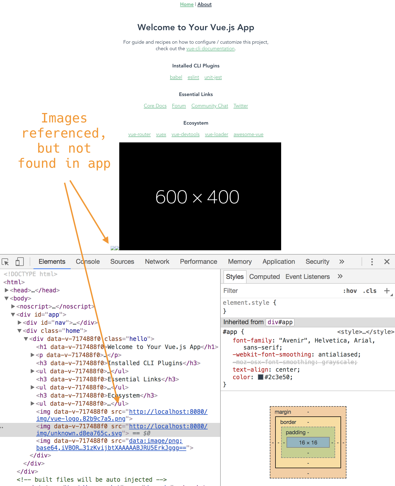

# error loading lib created with vue-cli

Creating a library using `vue-cli` works, but I'm having issues with
an application displaying an image inside the library component:



How should I create/use this component so images are refrenced properly?

## Steps to reproduce

```bash
git clone https://github.com/johnwebbcole/vue-cli-scoped-lib-issue.git
cd vue-cli-scoped-lib-issue
cd lib1
npm i
npm run build
cd ..
cd app1
npm i
npm run serve
```

I think the library is being built correctly, because the images are in `dist/img`.

How do I ensure the images referenced in the library component are found
by web pack in the `app` using the library?
